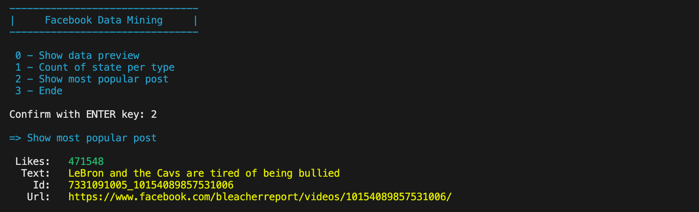

# Facebook Data Mining

## Install dependencies

* [csvkit](https://csvkit.readthedocs.io/en/latest/tutorial/1_getting_started.html#installing-csvkit)

## Usage

run the script within a bash environment `./facebook.sh`

## Methods

| ID  | Funktion | Beschreibung |
|---|--------------------------------|--------------------------------------------------------------------------------------------------------------------------------------------------|
| 0 | Datenpreview anzeigen | Um sich einen Überblick der Datenstruktur verschaffen zu können ist die Funktion, welche einige Zeilen am Anfang der Datei formatiert auflistet.  |
| 1 | Auswertung aller Stati pro Typ | Eine Auswertung, wie viele Status (status_id) in jeder Statusart (status_type) vorliegen |
| 2 | Belibtesten Eintrag anzeigen | Auflistung des beliebtesten Statuseintrags (Summe der Spalte 8 bis 15). |
| 3 | Ende | Beendet das Script |

## Testing Protocol

| T-1 | Input Datei nicht vorhanden |
|-----------------|:----------------------------------------------------------------------------|
| Voraussetzung | Script wird ohne eine facebook.csv Datei im gleichen Verzeichnis gestartet |
| Erwarteter Output | Fehlermeldung: Datei facebook.csv nicht vorhanden |
| Bestanden | Nein |

| T-2 | Input ist keine valide CSV Datei |
|-----------------|:----------------------------------------------------------------------------|
| Voraussetzung | Die Datei facebook.csv ist vorhanden, kann aber nicht mit dem Delimeter `,` geparsed werden.|
| Erwarteter Output | Fehlermeldung: Datei facebook.csv ist keine gültige CSV Datei |
| Bestanden | Nein |

